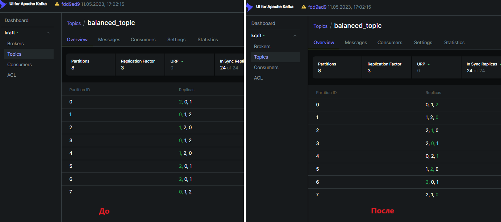
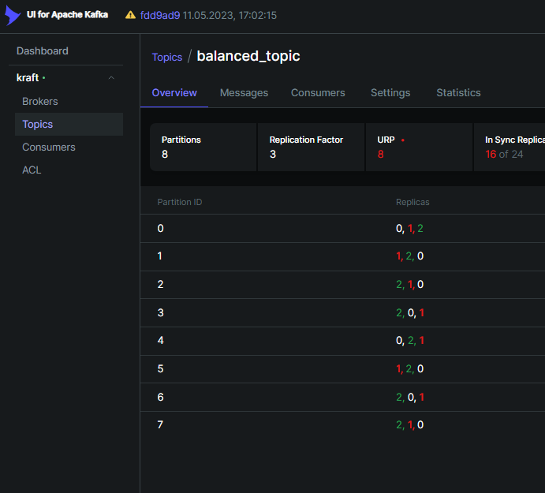
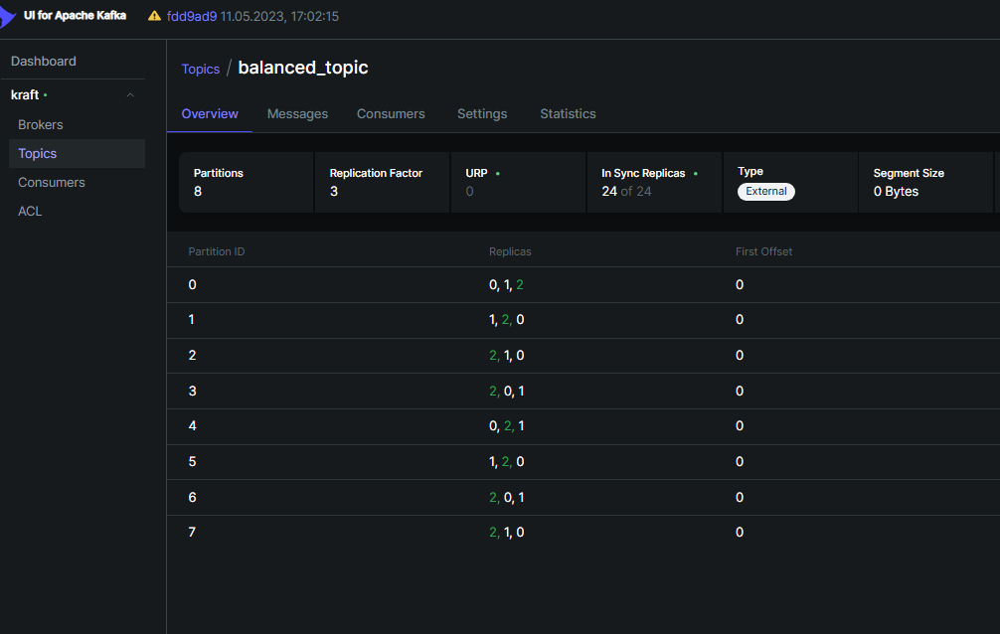

## Последовательность действий

* `docker compose up -d`
* `docker compose exec kafka-0 kafka-topics.sh --create --topic balanced_topic --bootstrap-server localhost:9092 --partitions 8 --replication-factor 3`
* `docker compose exec kafka-0 kafka-reassign-partitions.sh --bootstrap-server localhost:9092 --reassignment-json-file "/tmp/reassignment.json" --execute`

Новое распределение реплик стало соответствовать reassignment.json:

* `docker compose down kafka-1`

Видим, что топик стал under replicated, и лидер поменялся:

* `docker compose up -d kafka-1`

Видим, что 1 брокер снова доступен и репликация восстановилась:

## Выводы:
* С помощью специально сформированного json-файла можно перераспределить партиции по брокерам
* При отключении брокера от кластера партиции переходят в состояние under replicated, после восстановления брокера репликация восстанавливается