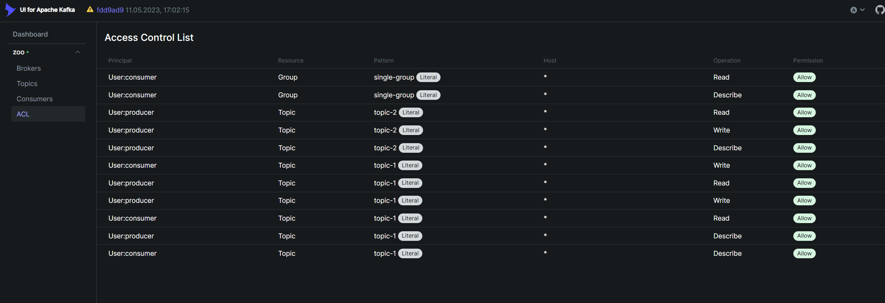

## Комментарии

* Всё взаимоидействие с брокерами происходит с TLS и SASL, включая взаимодействие между брокерами (listener INTERNAL)
* Используется Zookeeper, без KRaft
* Управление кластером (запуск утилит) происходит с брокера kafka-1, туда смонтирован [админский конфиг](admin-config.conf)
* Kafka UI и Schema registry настроены на работу с SASL_SSL и успешно работают
* За основу Producer и Consumer была взята [Практическая работа 2](https://github.com/sakharovaan/yandex-kafka?tab=readme-ov-file), единственное изменение в них - добавление авторизации и SSL (в файле ./consumer|producer/src/main.py, функции start_producer и start_consumer)

## Последовательность действий для запуска

Создание CA
* `openssl req -new -nodes -x509 -days 365 -newkey rsa:2048 -keyout ssl/ca.key -out ssl/ca.crt -config ssl/ca.cnf`
* `cat ssl/ca.crt ssl/ca.key > ssl/ca.pem`


Создание truststore и keystore для брокера kafka-1
```bash
openssl req -new -newkey rsa:2048 -keyout ssl/kafka-1-creds/kafka-1.key -out ssl/kafka-1-creds/kafka-1.csr -config ssl/kafka-1-creds/kafka-1.cnf -nodes
openssl x509 -req -days 3650 -in ssl/kafka-1-creds/kafka-1.csr -CA ssl/ca.crt -CAkey ssl/ca.key -CAcreateserial -out ssl/kafka-1-creds/kafka-1.crt -extfile ssl/kafka-1-creds/kafka-1.cnf -extensions v3_req
openssl pkcs12 -export -in ssl/kafka-1-creds/kafka-1.crt -inkey ssl/kafka-1-creds/kafka-1.key -chain -CAfile ssl/ca.pem -name kafka-1 -out ssl/kafka-1-creds/kafka-1.p12 -password pass:your-password
keytool -importkeystore -deststorepass your-password -destkeystore ssl/kafka-1-creds/kafka.kafka-1.keystore.pkcs12 -srckeystore ssl/kafka-1-creds/kafka-1.p12 -deststoretype PKCS12  -srcstoretype PKCS12 -noprompt -srcstorepass your-password
keytool -import -file ssl/ca.crt -alias ca -keystore ssl/kafka-1-creds/kafka.kafka-1.truststore.jks -storepass your-password -noprompt -storetype JKS
echo "your-password" > ssl/kafka-1-creds/kafka-1_sslkey_creds
echo "your-password" > ssl/kafka-1-creds/kafka-1_keystore_creds
echo "your-password" > ssl/kafka-1-creds/kafka-1_truststore_creds 
```

Создание truststore и keystore для брокера kafka-2
```bash
openssl req -new -newkey rsa:2048 -keyout ssl/kafka-2-creds/kafka-2.key -out ssl/kafka-2-creds/kafka-2.csr -config ssl/kafka-2-creds/kafka-2.cnf -nodes
openssl x509 -req -days 3650 -in ssl/kafka-2-creds/kafka-2.csr -CA ssl/ca.crt -CAkey ssl/ca.key -CAcreateserial -out ssl/kafka-2-creds/kafka-2.crt -extfile ssl/kafka-2-creds/kafka-2.cnf -extensions v3_req
openssl pkcs12 -export -in ssl/kafka-2-creds/kafka-2.crt -inkey ssl/kafka-2-creds/kafka-2.key -chain -CAfile ssl/ca.pem -name kafka-2 -out ssl/kafka-2-creds/kafka-2.p12 -password pass:your-password
keytool -importkeystore -deststorepass your-password -destkeystore ssl/kafka-2-creds/kafka.kafka-2.keystore.pkcs12 -srckeystore ssl/kafka-2-creds/kafka-2.p12 -deststoretype PKCS12  -srcstoretype PKCS12 -noprompt -srcstorepass your-password
keytool -import -file ssl/ca.crt -alias ca -keystore ssl/kafka-2-creds/kafka.kafka-2.truststore.jks -storepass your-password -noprompt -storetype JKS
echo "your-password" > ssl/kafka-2-creds/kafka-2_sslkey_creds
echo "your-password" > ssl/kafka-2-creds/kafka-2_keystore_creds
echo "your-password" > ssl/kafka-2-creds/kafka-2_truststore_creds 
```

Создание truststore и keystore для брокера kafka-3
```bash
openssl req -new -newkey rsa:2048 -keyout ssl/kafka-3-creds/kafka-3.key -out ssl/kafka-3-creds/kafka-3.csr -config ssl/kafka-3-creds/kafka-3.cnf -nodes
openssl x509 -req -days 3650 -in ssl/kafka-3-creds/kafka-3.csr -CA ssl/ca.crt -CAkey ssl/ca.key -CAcreateserial -out ssl/kafka-3-creds/kafka-3.crt -extfile ssl/kafka-3-creds/kafka-3.cnf -extensions v3_req
openssl pkcs12 -export -in ssl/kafka-3-creds/kafka-3.crt -inkey ssl/kafka-3-creds/kafka-3.key -chain -CAfile ssl/ca.pem -name kafka-3 -out ssl/kafka-3-creds/kafka-3.p12 -password pass:your-password
keytool -importkeystore -deststorepass your-password -destkeystore ssl/kafka-3-creds/kafka.kafka-3.keystore.pkcs12 -srckeystore ssl/kafka-3-creds/kafka-3.p12 -deststoretype PKCS12  -srcstoretype PKCS12 -noprompt -srcstorepass your-password
keytool -import -file ssl/ca.crt -alias ca -keystore ssl/kafka-3-creds/kafka.kafka-3.truststore.jks -storepass your-password -noprompt -storetype JKS
echo "your-password" > ssl/kafka-3-creds/kafka-3_sslkey_creds
echo "your-password" > ssl/kafka-3-creds/kafka-3_keystore_creds
echo "your-password" > ssl/kafka-3-creds/kafka-3_truststore_creds 
```

Поднятие Kafka и Schema Registry
```bash
docker compose up -d schema-registry
```

Создание топиков
```bash
docker compose exec kafka-1 kafka-topics.sh --create --topic topic-1 --bootstrap-server localhost:9094 --command-config /admin-config.conf
docker compose exec kafka-1 kafka-topics.sh --create --topic topic-2 --bootstrap-server localhost:9094 --command-config /admin-config.conf
```

Применим ACL к созданным топикам
```bash
docker compose exec kafka-1 kafka-acls.sh --bootstrap-server localhost:9094 --command-config /admin-config.conf --add --allow-principal User:consumer --operation Read --operation Write --operation Describe --topic topic-1 
docker compose exec kafka-1 kafka-acls.sh --bootstrap-server localhost:9094 --command-config /admin-config.conf --add --allow-principal User:producer --operation Read --operation Write --operation Describe --topic topic-1 

docker compose exec kafka-1 kafka-acls.sh --bootstrap-server localhost:9094 --command-config /admin-config.conf --add --allow-principal User:producer --operation Read --operation Write --operation Describe --topic topic-2
```

Применим ACL для консьюмера на доступ к группе
```bash
docker compose exec kafka-1 kafka-acls.sh --bootstrap-server localhost:9094 --command-config /admin-config.conf --add --allow-principal User:consumer --operation Read --operation Describe --group single-group
```

Запустим producer и consumer
```bash
docker compose up -d producer consumer
```

Отправим сообщения через producer
```bash
for i in $(seq 1 100); do curl -vv -XPOST -d '{"text": "message"}' -H "Content-Type: application/json" localhost:9000/api/v1/kafka/send; done
```

В логах consumer должны отображаться полученные сообщения
```bash
docker compose logs -f consumer
```

```json
{"topic": "topic-1", "partition": 0, "offset": 987, "key": null, "message": {"text": "message"}, "timestamp": 1748544432459}
```

Скриншот ACL:

